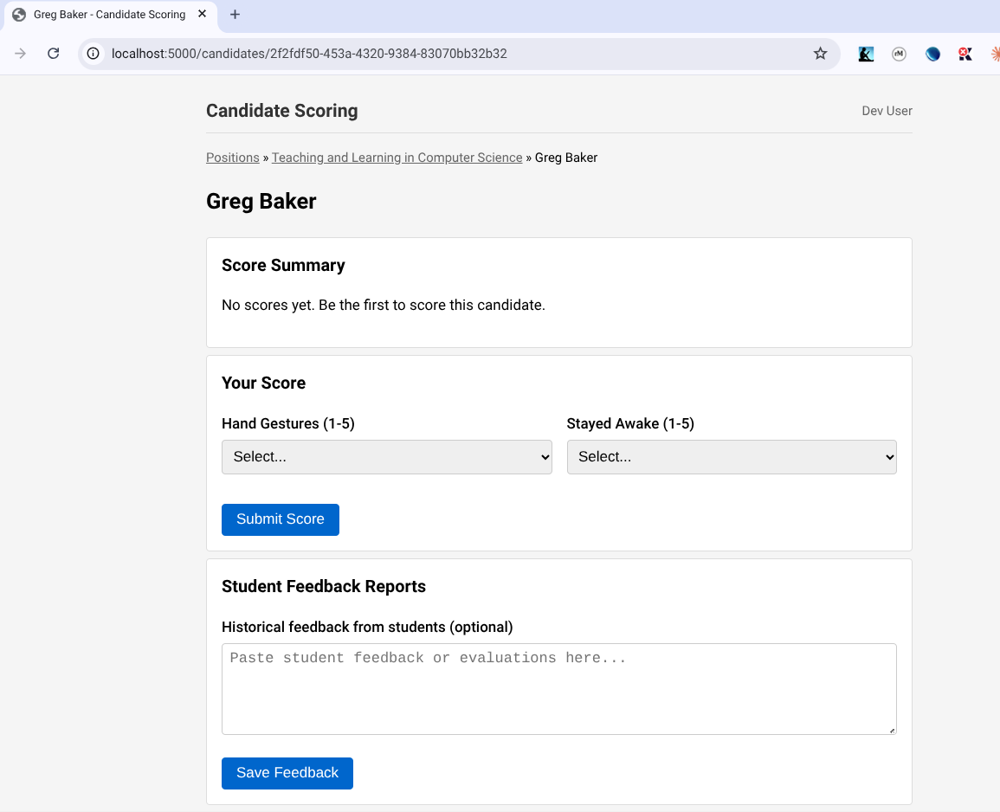

# Candidate Scoring App

A web application for scoring academic interview candidates, built in C++.

I (Greg Baker) created this during a 20-minute teaching demonstration for
a position at Macquarie University in 2026. (This paragraph is the only
one that was written by a human being.)

## Screenshot



## Building and Running

```bash
make
./candidate_scoring
```

Then open http://localhost:5000

The database is created automatically on first run.


## Prompts Used to Create This Application

The following prompts were given to Claude Code to build this application:

### Prompt 1: Initial Requirements
> I need a specification for a simple web app to score candidates during academic hiring interviews. I want to rate candidates on (1) the quality of their hand gestures and (2) whether I stayed awake. Use askquestions until you understand the requirements well enough to write a proper specification document.

### Prompt 2: Database Design
> Based on this specification, create a database design and implement it in a sqlite database

### Prompt 3: Implementation
> Implement the application that we have specified.

### Prompt 4: Language Change
> You were supposed to be writing in C/C++. (Feel free to apt install and libraries that you would need in order to do this).

### Prompt 5: Documentation
> Write a README.md file that contains the prompts that you have been given.
